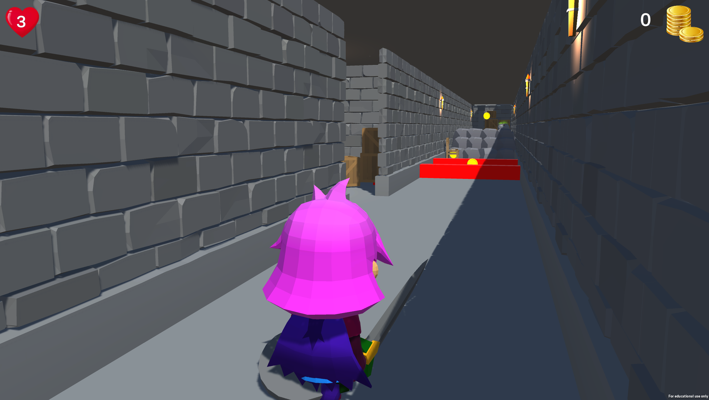

# Project 1

Small starter project for learning Unity controls and collision.  The player will collect 6 coins throughout the game world and win if all 6 are collected without losing all 3 lives.  If the player touches a red obstacle they will die, restart the level, and lose 1 life.  When all 3 lives are lost, the game is over. 

## Getting Started

### Prerequisites

- Unity 2020.3.15f2 or later.

### Installation

1. Clone the repo: `git clone https://github.com/saddiejaneb/project1_icg.git`
2. Open the project in Unity.
3. Load the main scene located at `assets/Scenes/DungeonScene`. 

## Usage

Describe how to play the game. Include controls and objectives.

- **Move**: W, A, S, D
- **Jump**: Space
- Objective: Collect all 6 coins without dying

## Contributing

Pull requests are welcome. For major changes, please open an issue first to discuss what you'd like to change.

## Credits

- Unity Asset: [Starter Assets - Third Person Character Controller | URP]([(https://assetstore.unity.com/packages/essentials/starter-assets-third-person-character-controller-urp-196526)])
- Design: [Unity Technologies]
- Development: [Unity Technologies]

- Unity Asset: [Simple Collectibles Pack](https://assetstore.unity.com/packages/3d/props/simple-collectibles-pack-123092))
- Design: [Dillon Wallace]
- Development: [Dillon Wallace]

- Unity Asset: [Low Poly Dungeons Lite](https://assetstore.unity.com/packages/3d/environments/dungeons/low-poly-dungeons-lite-177937)
- Design: [JustCreate]
- Development: [JustCreate]

- Unity Asset: [RPG Tiny Hero Duo PBR Polyart](https://assetstore.unity.com/packages/3d/characters/humanoids/rpg-tiny-hero-duo-pbr-polyart-225148#publisher)
- Design: [Dungeon Mason]
- Development: [Dungeon Mason]

  
## License

This project is licensed under the MIT License - see the [LICENSE.md](LICENSE.md) file for details.
